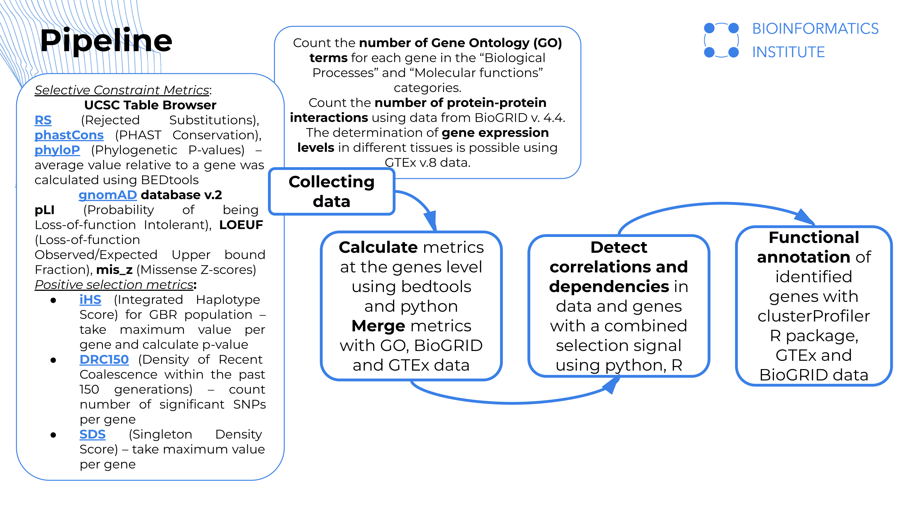
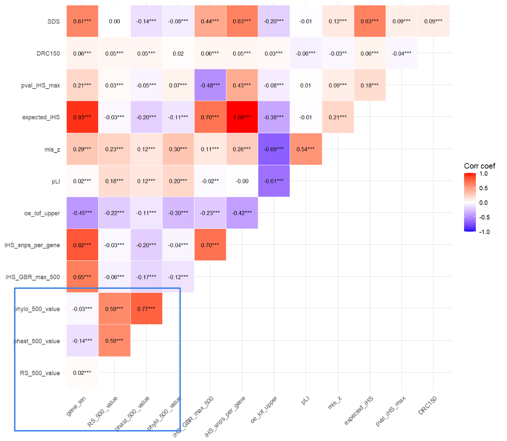
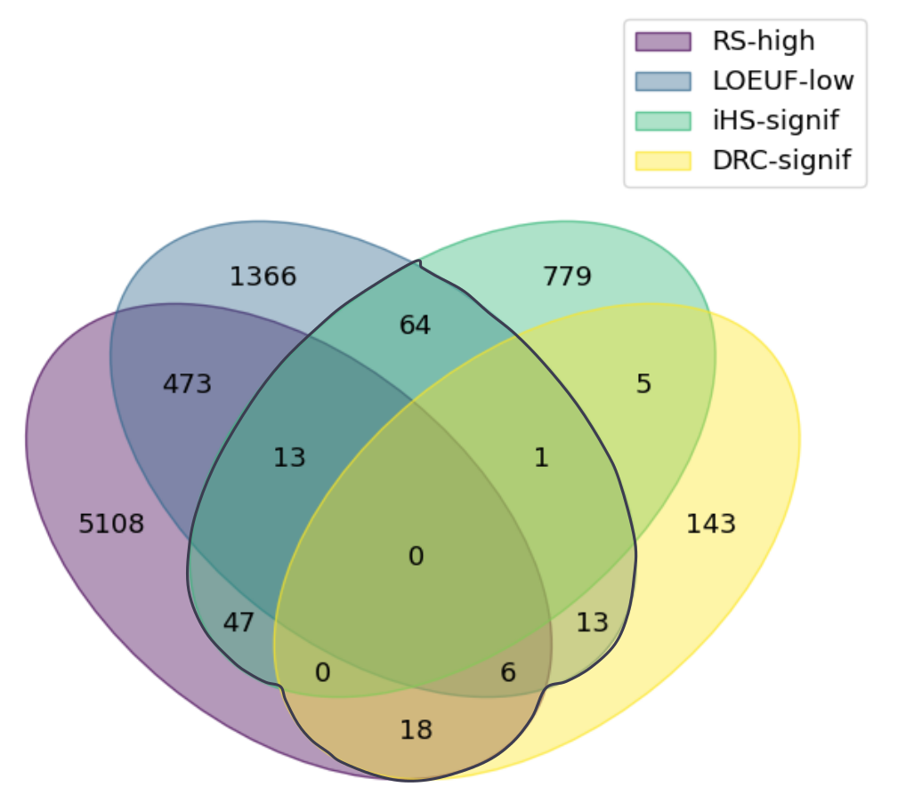
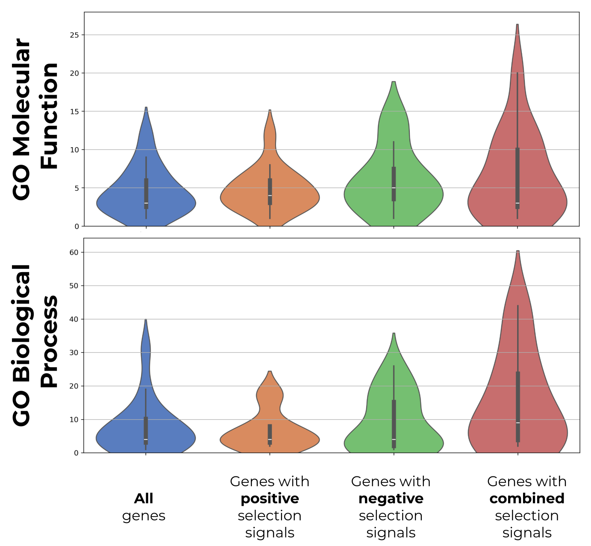
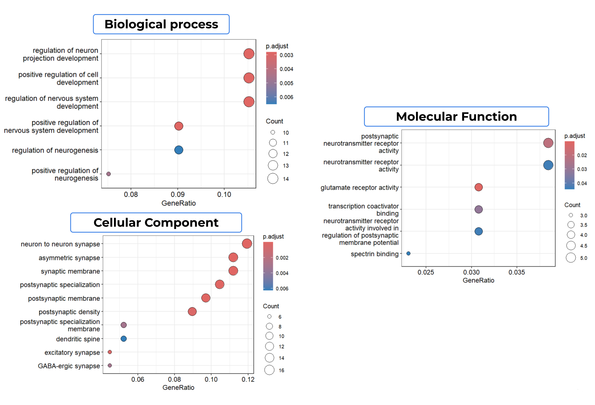

# Understanding the combined positive and negative selection signals in human genome and beyond

Author: Polina Malysheva

Supervisor: Yury Barbitoff

## Table of content

[Aim and objectives of project](#aim-and-objectives-of-project)

[Workflow](#workflow)

[Results](#results)

[Conclusion](#conclusion)

[Literature](#literature)

[Repository structure](#repository-structure)

## Aim and objectives of project

Natural selection is a key mechanism of evolution. The study of selection signals in the human genome focuses most on positive and negative selection. Positive selection results in the fixation of a beneficial allele in a population. Negative selection leads to the elimination of an allele that reduces an individual's fitness. Interestingly, some genes carry signals of both positive and negative selection [(Barbitoff et. al., 2024)](https://doi.org/10.1101/2024.10.28.620594). In this study, we examine the phenomenon of combined selection signals in the human genome and identify genes that carry this signature.

**Main goal**: detailed study of the phenomenon of combined selection signatures.

**Objectives**:

✓ Obtain all available data with metrics of positive and negative selection in the human genome (for the hg19 assembly) and convert them to a per gene level.

✓ Examine metrics, find correlations and identify a list of genes with a combination of signals.

✓ Functional annotation of identified genes and detection of properties that distinguish them from others.

## Workflow

Workflow is shown in the figure below 



## Results

1. A total of 57,783 genes were included in the analysis (mitochondrial genes were excluded). Negative selection metrics, which are based on multiple alignments, showed a **strong positive correlation** (Spearman’s p for phastCons-phyloP: 0.77; phastCons-RS: 0.59; phyloP-RS: 0.59). Expectedly, we observed a **strong negative correlation** between the negative selection metrics from the gnomAD database (LOEUF-mis_z correlation coefficient: -0.69).



P-values are indicated by asterisks: pvalue < 0.001 – ***, pvalue < 0.01 – **, pvalue < 0.05 – *.

2. Out of 57,783 genes, **163 genes** were obtained with both positive and negative selection signals. Among these, there were 146 protein-coding genes, 7 antisense RNAs, 5 lincRNAs, 4 pseudogenes, and 1 processed transcript.



3. Using per-gene GO terms counts,  we found that genes carrying the combined selection signal participate in a higher number of biological processes and have a broader range of molecular function compared to an average gene in the genome (Mann-Whitney U test, p-value for Biological Process: 3.3e-08; for Molecular Functions: 8.2e-08).

   

These genes were found to be involved in processes related to the regulation of nervous system development, signaling between nerve cells, and the positive regulation of cell differentiation.

 

## Conclusion

Here we identified 163 genes that carry combined selection signals and they are localized on chromosomes 2 and 14, the largest number (19 genes) on chromosome 17. This observation highlights the unusual origin of chromosome 17, which contains many genes involved in cancer and regulation of genome stability [(Zody et. al., 2006)](https://doi.org/10.1038/nature04689). GO annotation showed a large proportion of genes involved in processes occurring in the nervous system. This emphasizes the importance of the nervous system in human evolution and the acquisition of complex patterns of adaptation to environmental conditions.

## Literature

Barbitoff Y. A., Bogaichuk P.M., Pavlova N.S., Predeus A.V. (2024). Functional determinants and evolutionary consequences of pleiotropy in complex and Mendelian traits. Preprint. https://doi.org/10.1101/2024.10.28.620594.

Zody M., Garber M., Adams D. et al. (2006). DNA sequence of human chromosome 17 and analysis of rearrangement in the human lineage. Nature 440, 1045–1049. 
https://doi.org/10.1038/nature04689

## Repository structure

```bash
├── analysis_in_R
│    Here is the code for working with the clusterProfiler package and GO enrichment analysis
├── code
│    The main code for data processing includes counting metrics, combining them into one dataset, 
│    exploring dependencies between metrics, searching for genes with a combined selection signal, 
│    and plotting different groups of genes
└── data
    ├── annotation
    │   Human genome annotation with the following information: chromosome, start and end of gene,
    │   strand, gene name and type. One- and zero-based
    ├── biogrid
    │   Number of protein-protein interactions and names of interactors for genes
    ├── drc150_positive_selection
    │   Raw and processed data for metric DRC150
    ├── gerp_phast_phylo
    │   Processed data for RS, phastCons and phyloP for different gene length
    ├── gnomAD
    │   gnomAD database v.2 and processed data (metrics pLI, LOEUF, mis_z)
    ├── go_analysis
    │   Numbers of GO terms for each gene in the Biological Process and Molecular Function categories
    ├── gtex_median_gene_expression_by_tissue
    │   Raw and processed data for GTEx v. 8
    ├── iHS
    │   Processed data for metric iHS
    ├── list_genes_css
    │   List of genes s with a combination of signals
    ├── merged_data
    │   Intermediate data which is necessary to create dataset
    ├── sds_positive_selection
    │   Processed data for metric SDS
```
